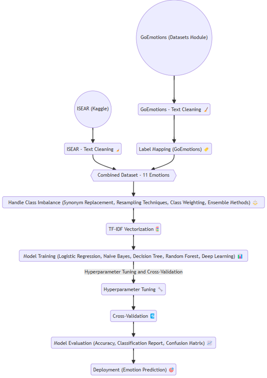

# Emotion Classification and Recommendation System for Mental Health Support

## Introduction
This project focuses on emotion classification using text data and provides recommendations for mental health resources based on the detected emotion. The system is designed to process textual inputs, classify the emotions expressed, and suggest relevant resources to improve emotional well-being. The project leverages a combination of advanced machine learning techniques and publicly available datasets.

The core of the project is a **Stacking Classifier** that combines multiple classical models, delivering robust performance. The model was trained on an augmented dataset combining the ISEAR and GoEmotions datasets.


## Methodology
The project follows the following methodology to achieve emotion classification and provide recommendations:

1. **Data Collection and Preprocessing**:
   - Collected and cleaned text data from ISEAR and GoEmotions datasets.
   - Addressed class imbalance using techniques like SMOTE and synonym-based augmentation.

2. **Model Selection**:
   - Experimented with classical machine learning models (Logistic Regression, Naive Bayes, etc.).
   - Finalized the Stacking Classifier for deployment based on superior performance metrics.

3. **Model Deployment**:
   - The best model and TF-IDF vectorizer were saved using **joblib**.
   - The deployment system uses **OpenAI API** for recommending mental health resources based on detected emotions.

### Methodology Diagram:


---
## Final Model and Dataset
### **Final Model:**
- **Stacking Classifier**:
  - Base Models: Logistic Regression, Naive Bayes, Decision Tree, Random Forest.
  - Meta-Model: Logistic Regression.
  - Training and validation were performed using hyperparameter tuning to achieve optimal results.
  - The final model was saved using **joblib** for efficient deployment.

### **Dataset Used:**
1. **ISEAR Dataset**:
   - Contains text samples labeled with seven emotions (e.g., joy, fear, anger).
   - Balanced and preprocessed for training.

2. **GoEmotions Dataset**:
   - Originally multi-label and with 28 emotions.
   - Transformed into 11 emotions and integrated with ISEAR.

3. **Augmented Dataset**:
   - Combines the cleaned ISEAR and GoEmotions datasets.
   - Addressed class imbalance using  **synonym-based augmentation techniques**.
   - Includes 11 emotions:
     - Joy, Sadness, Anger, Fear, Shame, Disgust, Guilt, Neutral, Surprise, Confusion, and Boredom.

---
## Run the Deployment Notebook
To deploy the emotion classification system:

1. Navigate to the src folder and open Emotion_Classification_Deployment.ipynb using Jupyter Notebook or Google Colab.
2. Nagivate to the API Key section and change it to your own key (send me an email if you don't have a key)
3. Run All Cells
4. Execute all the cells in the notebook. The deployment is pre-configured, so no additional file uploads are required.
5. Input Your Text: When prompted, enter a sentence describing your feelings (e.g., "I feel stressed and overwhelmed").
6. Results: The system will:
            Predict the emotion (e.g., "Sadness").
            Provide relevant mental health resources.
---

## Acknowledgments
We gratefully acknowledge the following resources and tools:

**Datasets:**
1. ISEAR Dataset for providing high-quality emotion-labeled text data.
2. GoEmotions Dataset for its large-scale emotion annotations.


**Tools and Libraries:**
1. TensorFlow: For implementing and training models.
2. scikit-learn: For machine learning experiments.
3. OpenAI API: For resource recommendations.

--- 

## Project Structure
```plaintext
emotion-classification/
├── data/
│   ├── ISEAR_dataset.csv                  # Raw ISEAR dataset
│   ├── ISEAR_cleaned.csv                  # Preprocessed ISEAR dataset
│   ├── GoEmotions_11_Emotions_Cleaned.csv # Cleaned GoEmotions dataset
│   ├── Combined_Emotion_Dataset.csv       # Combined dataset of ISEAR and GoEmotions
│   ├── Augmented_Emotion_Dataset.csv      # Final augmented dataset
│   └── README.md                          # Description of datasets
├── models/
│   ├── stacking_model.pkl                 # Trained stacking classifier model
│   ├── tfidf_vectorizer.pkl               # TF-IDF vectorizer used for model input
│   └── README.md                          # Description of models and usage
├── notebooks/
│   ├── 1.ISEAR_Dataset.ipynb              # Analysis and experiments on ISEAR dataset
│   ├── 2.GoEmotions_Dataset.ipynb         # Cleaning and preprocessing GoEmotions dataset
│   ├── 3.Combined_Dataset_11_emotions_Classical_ML_Without_Class_Imbalance.ipynb
│   ├── 4.Combined_Dataset_11_emotions_Classical_ML_With_Class_Imbalance_SMOTE.ipynb
│   ├── 5.Combined_Dataset_11_emotions_Classical_ML_With_Class_Imbalance_Class_Weighting.ipynb
│   ├── 6.Handle_Class_Imbalance_Data_Augmentation_Synonyms_Approach.ipynb
│   ├── 7.a.Augmented_Dataset_Classical_ML_Train_Test.ipynb
│   ├── 7.b.Augmented_Dataset_Ensemble_Classifiers.ipynb
│   ├── 8.a.Augmented_Dataset_Logistic_Regression_Train_Val_Test.ipynb
│   ├── 8.b.Augmented_Dataset_Logistic_Regression_Hyperparameter_Tuning_Cross_Validation.ipynb
│   ├── 9.a.Augmented_Dataset_Naive_Bayes_Train_Val_Test.ipynb
│   ├── 9.b.Augmented_Dataset_Naive_Bayes_Hyperparameter_Tuning_Cross_Validation.ipynb
│   ├── 10.a.Augmented_Dataset_Decision_Tree_Train_Val_Test.ipynb
│   ├── 10.b.Augmented_Dataset_Decision_Tree_Hyperparameter_Tuning_Cross_Validation.ipynb
│   ├── 11.a.Augmented_Dataset_Random_Forest_Train_Val_Test.ipynb
│   ├── 11.b.Augmented_Dataset_Random_Forest_Hyperparameter_Tuning_Cross_Validation_Train_Val_Test.ipynb
│   ├── 12.a.Augmented_Dataset_Stacking_Classifier_Base_Models.ipynb
│   ├── 12.b.Augmented_Dataset_Stacking_Classifier_Hyperparameter_Tuning.ipynb
│   ├── 13.Augmented_Dataset_CNN.ipynb
│   └── README.md                           # Description of notebooks
├── src/
│   ├── Emotion_Classification_Deployment.ipynb # Deployment code for emotion classification
│   ├── Joy.png                            # Sample run of the output
│   └── README.md                          # Description of deployment process
├── Metholodogy.png                        # Methodology of the project
├── README.md                              # Main project description
└── requirements.txt                       # List of required dependencies


---


