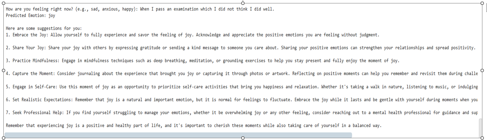

# Source Code (src) Folder

This folder contains the code for deploying the emotion classification system using the best-performing model (Stacking Classifier) and an additional feature for recommending mental health resources.

## Contents

### 1. **Emotion_Classification_Deployment.ipynb**
- **Purpose**: Deploy the emotion classification system and recommend mental health resources based on detected emotions.
- **Model Used**: Stacking Classifier (joblib format, trained version).
- **Features**:
  1. Emotion classification using text input.
  2. Mental health resource recommendations based on the detected emotion.
- **Dataset**: Preprocessed dataset used to train the best model (Stacking Classifier).
- **Usage**:
  - Simply run the notebook in Google Colab (no file uploads required).
  - Enter your emotion or a sentence describing your feelings.
  - The system will classify your emotion and provide resource recommendations.

## How to Use
1. Open the notebook in Google Colab.
2. Run all cells in the notebook.
3. When prompted, enter a text input describing your feelings (e.g., "I feel so anxious about work").
4. The system will:
   - Predict your emotion.
   - Recommend mental health resources tailored to your emotion.

## Sample Run
Below is an example of a sample run:

### Explanation of the Code:
- `![Sample Run]`: This is the syntax to add an image in Markdown.
- `(samples/Boredom.png)`: This is the relative path to the image file in your repository. Ensure the file is located in the `samples` folder.

---

### Steps to Ensure It Works:
1. Make sure the `samples/Boredom.png` file is added to your repository and pushed to GitHub.
2. Verify the folder structure in your GitHub repository matches the path (`samples/Boredom.png`).
3. Preview the **README.md** file on GitHub to confirm the image displays correctly.

Would you like further assistance with this or additional edits to the README?

